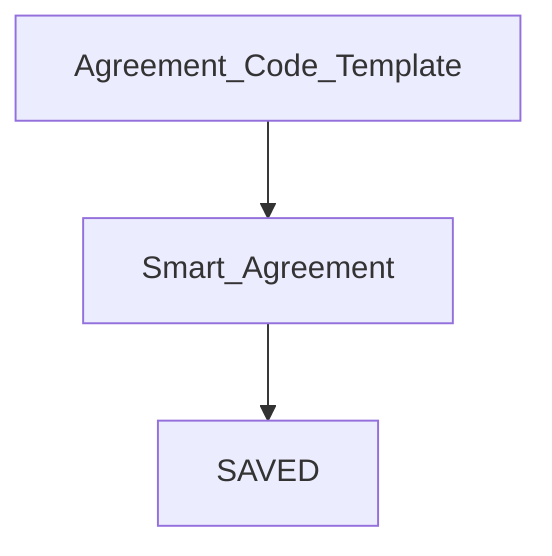

# Intro to Smart Agreements

#### links to related docs

- [Test Plan](./testing_docs/1_0_testing_plan.md)
- [Unyt Setup](../README.md)
- [Testing Documentation, Phase 4](./4_0_phase_4_testing_details.md)
- [Unyt Dictionary](./4_2_unyt-dictionary.md)
- [Intro to Smart Agreements (Three Layers)](./4_1_intro_to_smart_agreements.md)
- [Templates and Smart Agreements Library Repo](https://github.com/unytco/smart_agreement_library)
- [Feedback](https://github.com/orgs/unytco/projects/5/views/1)

## Agent Centric Smart Agreements

Smart Agreements are the closest thing in Unyt's Agent Centric architecture to Blockchain-based Smart Contracts, though they rest upon a different architecture of cryptographic mechanisms as well as a different social physics, namely that instead of relying on a global ordering of events stored in one network-wide log, each agent maintains their own log, and content authored by an agent is stored in their own log -- a structure (a hash chain) that establishes the order of that particular agent's actions. These actions as well as their relative ordering are then validated by a deterministic, but random group of other agents participating in that Unyt Accounting Alliance application.

## Why Agent Centric

So what? Einstein understood 120 years ago that there was no such thing as a global ordering of events. This was a key component of his theory of special relativity.

Well, whereas blockchains resort to various mechanisms to generate a social agreement about a global ordering of events, Unyt instead makes use of Holochain's agent-centric ordering of events paradigm, and layers validation rules on top of that in situations where some social agreement about the ordering of events across multiple agents is desirable. You could think of that as enabling the creation of agreement about the ordering of particular sets of events (consensus about the order of those events relative to one another) but tuneable for the specific contexts faced by -- and needs of -- the community rather than resorting to a one-size-fits-all "global consensus" approach.

## Benefits

This unique agent-centric foundation provides Unyt Smart Agreements with some features and affordances that are unavailable to blockchain based, or server based architectures. These include:

- parallel action taking and distributed transaction processing,
- reduced duplicative computational work,
- improvements in resource efficiency,
- which enables the software to run on ordinary hardware with lower bandwidth consumption,
- empowering a broader base of participants to participate (not just those who can afford to buy and maintain specialized equipment), and
- reductions in transaction fees relative to other systems.
- It also can unlock support for offline transactions in certain contexts.

## Mechanics of Smart Agreements

A Smart Agreement is simply code (i.e. text) and references to other code that defines how a particular set of inputs will be transformed into a set of outputs, where those inputs will come from, and who is authorized to perform an execution (i.e. a transformation of a particular set of inputs into outputs.

## Three Layers

Any system which implements Smart Agreements will include these three layers for proper usage.

## 1. Code Template

Publishing Code Templates allows the primary logic built into a Smart Agreement to be reused by multiple Smart Agreements.

**Template Name:** This is the Title of your Code Template.

**Input Schema:** Needs to be a JSON Schema that can be used to define the structure of the expected inputs into the `execution_code` and can be used to validate the input in any resulting Smart Agreement.

**Execution Code:** This is the code that will be executed to transform inputs into outputs and publish them in a manner that can be validated as appropriate by any other participant in a `SAVED` (Smart Agreement Verifiable Execution Doc). Currently we support executing [RHAI](https://rhai.rs) code. You can find some [examples here](https://github.com/unytco/rave_library/tree/main/library).

**Output Schema:** Similar to the input Schema this needs to be a JSON Schema and would be the expected output of the Execution Code

## 2. Smart Agreement
For the code in a Code Template to become a Smart Agreement that can be executed, it needs to be bound to certain information about **HOW it can be EXECUTED, WHO can execute it, Which ROLES agents can interact with it through, WHO qualifies for each ROLE, and WHERE its inputs should come from**.

**Executor:** Can this agreement be executed by 
1) any single agent, or 
2) a specific, authorized agent.

**Inputs:** The fields defined in the template's Input Schema must be mapped to some source, either: 
1) provided by an agent in a Role, 
2) provided by the executor at runtime, 
3) a fixed value, or 
4) a result of a query of the content in the app's shared storage.

## 3. RAVE (Record of Agreement Verifiably Executed)
When an agent executes a Smart Agreement, they generate a record of the execution which can be verifed as valid by any agent. This document is the product of the execution. It contains the inputs used, the link to the Smart Agreement being executed, and the outputs it produced.

The RAVE can be examined by any other Alliance member, who can verify that it has been executed validly. Consequently, we describe the resulting Record of Execution as a "Record of Agreement Verifiably Executed" or RAVE. Again, even though a particular party performed the execution, any party can independently verify that the execution was done appropriately.

A RAVE is produced *after* an Execution of a Smart Agreement.  It is the primary artifact resulting from that Execution, and is published by its author, the Executor, into the shared space of the Unyt Accounting Alliance for a group of peers to validate, store and serve, and for any peer to reference and rely upon.

### What role does a RAVE play in Payments?

Not all Smart Agreements involve Spending and Allocating Base Units.  However, Spending and Allocating Base Units to some Receiver in accordance with some particular custom logic is a very common way to use Smart Agreements. After the Execution of such a Smart Agreement, the RAVE will allocate Base Units to the appropriate Receiver (or Receivers). However, that Receiver will still need to Accept the Base Units before their account will be credited.

This is interesting in that, the Execution is complete, the Base Units have been allocated, but the Receiver themselves still has to exercise their agency and choose whether to receive the credits. When they do Accept, their device also performs an independent check of the validity of the transaction. If the transaction is invalid, their device will reject the transaction. If it is valid, their device will cryptographically sign the Acceptance of the transaction.

As a result, others aren't able to force credits onto you that you don't wish to accept. And others that attempt to commit fraud on your behalf require your collusion -- and your taking of responsibility as well.

Such activity would quickly get both them and you kicked out of the application by peers, who one-by-one, would turn away from you automatically for having violated the rules of the Unyt Alliance.

### Validation of a SAVED:
**Execution Authority:** This was executed by an agent who meets the authorization requirements defined in the Smart Agreement.

**Input Schema:** The structure of the inputs is validated against the JSON schema in the Smart Agreement (and the Code Template that it is derived from) for the inputs.

**Input Sources:** The inputs came from the places defined in the Smart Agreement (e.g. links were parked on the correct base for queries, consumable links were not already consumed by prior executions, etc.)

**Output Schema:** The structure of the outputs is validated against the JSON schema for the outputs.

**Output Values:** These are the outputs produced by the executable code processing the provided inputs. Anyone can validate them by passing the inputs shown above into the executable code. They should receive these identical outputs (structured to comply with the output schema).

**Matching Inputs & Outputs:** The number of units included as inputs, must match the total number of units in the outputs. Like the first law of thermodynamics, a RAVE must not create or destroy units.

Next, if you haven't already, check out the [Phase 4 Testing Details](./4_0_phase_4_testing_details.md)